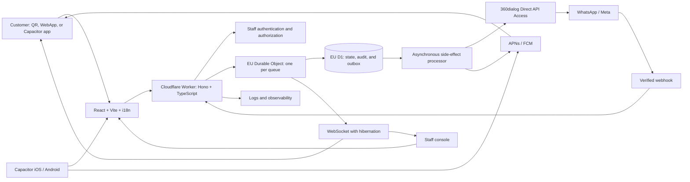

# PRD: No Queue MVP with a Wrapped Web App

**Audience:** product, UX/UI, and engineering  
**Status:** implementation and validation baseline  
**Product languages:** Spanish and English  
**Time boundary:** up to eight sprints; any additional work requires an explicit scope extension.

## 1. Executive summary

No Queue lets a hospitality customer join a venue queue from a QR code, follow the status of their turn, and receive operational notifications. Staff operate the queue from an authenticated console. The WebApp remains the primary entry channel and is wrapped with Capacitor for iOS and Android distribution, including builds, native push, deep links, certificates, and initial App Store and Google Play publication.

The approved scope is a real-time, multi-tenant virtual queue with WhatsApp as a complementary channel. The WebApp remains the source of truth: customers can recover and manage their turn when WhatsApp, push, or real-time connectivity is unavailable.

### Status labels

| Label | Meaning |
|---|---|
| **Approved fact** | A client-approved decision that directs implementation. |
| **Working assumption** | A design hypothesis that must be validated before the affected work is frozen. |
| **Pending decision** | An unresolved choice with a named owner and impact; it is not implicit approval. |

### Approved facts

- The client accepted **Option 4**: a wrapped WebApp for iOS and Android, in Spanish and English, delivered within up to eight sprints.
- Scope includes builds, native push, deep links, certificates, and the first publication submission to App Store and Google Play.
- Automated promotions and operational reporting are currently out of scope. Operational events are captured, but no reporting dashboard is delivered.
- No maintenance is contracted. No extra sprints are included without explicit scope expansion.
- Only the client and developer participate. The client owns accounts, payments, terms, identity, recovery, and legal decisions. The developer operates through delegated permissions and never through shared credentials.
- WhatsApp uses 360dialog Client Hub directly, Direct API Access, and 360dialog-hosted Embedded Signup, without a partner. The client owns the Meta Business Portfolio, WABA, and phone number.
- The domain is `noqueue-app.com`. Cloudflare Workers, D1, Durable Objects, logs, and the domain DNS have been validated. The staging Worker and permanent `staging.noqueue-app.com` subdomain **will be created when the application exists**; they do not exist yet.

## 2. Problem, objectives, and non-goals

### Problem

Hospitality queues are often managed through physical waiting and manual coordination. Customers do not know their position or approximate wait; staff lack a single reliable status when multiple operators work at once. The product must reduce this uncertainty without requiring app installation at the QR conversion point.

### Objectives

1. Allow immediate queue entry from QR without a customer account.
2. Give staff a consistent, auditable, real-time queue.
3. Show a customer their code, position, and approximate wait, with recovery after refresh or disconnection.
4. Send operational WhatsApp notices when opt-in and activation are available, without making WhatsApp a dependency.
5. Publish a wrapped iOS and Android build that adds native push and deep links without replacing the WebApp.
6. Keep customer accounts, data, and assets under client control.

### Non-goals

- Reservations, payments, PMS, POS, CRM, ERP, or SSO.
- Physical-queue hardware: ticket dispensers, printers, and external display screens.
- Physical queue operation in the initial release.
- Promotions, WhatsApp/push marketing, campaigns, segmentation, or A/B testing.
- Operational reporting, CSV exports, or BI. Only future-ready event capture is included.
- Self-service SaaS onboarding, plans, subscriptions, billing, or automatic provisioning.
- Historical prediction, priorities, automatic table-size assignment, advanced space optimization, or offline support.
- Contracted maintenance, SLA, 24/7 support, or future provider/SDK policy changes.

## 3. Approved scope and exclusions

| Area | Included | Excluded or conditional |
|---|---|---|
| Queues | Virtual queues by organization, venue, and service; opening, pausing/closing, configuration, joining, calling, arrival, cancellation, and no-show. | Hardware and physical queue operation. |
| Customer | QR, open-queue selection, validated form, code, position, approximate ETA, recovery, leave, skip, and basic party-size change. | Customer registration/login and offline support. |
| Staff | Authentication, queue creation/configuration/publication, dashboard, and turn actions. | Configurable roles and SaaS administration. |
| Real time | State synchronization and authoritative recovery after reconnect. | Using WebSocket as the consistency mechanism. |
| WhatsApp | Opt-in/out, bilingual Utility templates, webhooks, native actions when available, retries, idempotency, and WebApp fallback. | Marketing, partners, unofficial WhatsApp Web clients, and external approval guarantees. |
| Mobile | Capacitor, iOS/Android, builds, APNs/FCM, deep links, certificates, device testing, and initial publication. | Separate native apps or a second React Native UI. |
| Data/operations | EU-jurisdiction D1 and Durable Objects, backup/recovery, logs, and technical audit. | Claiming GDPR compliance merely because infrastructure is in the EU. |

## 4. Actors, roles, and ownership

| Actor | Capabilities | Boundaries |
|---|---|---|
| End customer | Joins from QR, manages their turn, receives notices if they opt in. | Has no staff account; visible turn code is not a credential. |
| Operational staff | Operates queues for authorized venues. | Cannot cross organization or venue isolation. |
| Client owner | Owns accounts, domains, billing, identity, recovery, terms, publication, and legal decisions. | Does not delegate identity, OTP, or legal acceptance to the developer. |
| Developer | Implements, configures, tests, and operates with least-privilege delegated access. | Is never account owner or recovery custodian; does not receive passwords, OTPs, private keys, or repository secrets. |
| Providers | Cloudflare, Apple, Google, Firebase/FCM, Meta/WhatsApp, and 360dialog. | Their reviews, approvals, policies, and availability are not developer delivery commitments. |

**Working assumption:** the MVP exposes one operational staff role. The future `owner`, `admin`, `venue_manager`, `staff`, and `viewer` hierarchy is not configurable in this release.

## 5. Users and journeys

### J1. Customer joins and waits

1. The customer scans a QR code associated with a queue.
2. The WebApp shows availability, visible demand/position, and approximate wait.
3. They supply the minimum queue fields and may separately opt in to WhatsApp.
4. The system verifies opening status, capacity, and duplicate submission.
5. It creates a turn with a visible code and opaque recovery token.
6. The customer sees current state, approximate ETA, position, and available actions; they can reopen the turn from the same device or a signed link.
7. They receive WhatsApp/push when applicable. If delivery fails, they use the WebApp.

### J2. Staff configure and operate a queue

1. Staff sign in and enter their authorized organization/venue.
2. They create or edit a queue: type, name, timetable, closing cut-off, capacity, average duration, arrival grace period, and required fields.
3. They publish/open the queue and obtain its defined QR.
4. They see waiting, called, completed, cancelled, and no-show turns.
5. They call the next customer, confirm arrival, cancel, mark no-show, or edit permitted data.
6. Every confirmed change persists, creates an audit event, updates connected views, and schedules external notifications outside the critical path.

### J3. Customer acts through WhatsApp

1. Only after opt-in, the backend sends an approved bilingual Utility template containing an opaque code/state/ETA and secure deep link.
2. The customer selects an allowed action such as leave or skip.
3. 360dialog delivers a webhook; the backend verifies its source/signature, deduplicates it, and applies only a valid state transition.
4. The customer receives confirmation and the WebApp refreshes in real time.
5. Business-initiated messages outside the 24-hour customer-service window use an approved template. Opt-in alone does not open that window.

### J4. Recovery and degraded operation

1. After refresh, disconnection, or a missed notice, the customer opens the QR or signed link.
2. The application reads the authoritative turn state.
3. WebSocket reconnects. If it cannot, the UI communicates stale status and permits refresh; no lost notification changes functional turn state.

## 6. Prioritized functional requirements and acceptance criteria

Priority: **P0** delivery-critical; **P1** WhatsApp/mobile scope; **P2** deferred.

| ID | Priority | Requirement | Verifiable acceptance criteria |
|---|---:|---|---|
| RF-01 | P0 | Public QR entry without login. | A valid QR opens its queue without account creation; invalid QR/queue produces a clear message without exposing data. |
| RF-02 | P0 | Availability and joining. | Joining is allowed only when published, open, in schedule, before closing cut-off, and within capacity; other cases explain why. |
| RF-03 | P0 | Adaptive, validated form. | The queue defines supported minimum fields such as name, room where applicable, phone where applicable, party size, and other validated inputs; invalid submissions are not persisted. |
| RF-04 | P0 | Secure turn and recovery. | Each join creates a unique visible code and non-sequential opaque token; the code grants no access; same device and signed link recover the turn; revoked/expired tokens expose nothing. |
| RF-05 | P0 | Turn status. | Customer sees state, clearly-labelled approximate ETA, position/compatible groups ahead according to final rule, and visible code; reconnect reads latest state. |
| RF-06 | P0 | Customer actions. | Customer can leave, skip, and change party size only in allowed states; UI confirms result; repeated commands do not duplicate effects. |
| RF-07 | P0 | Staff authentication and isolation. | Every staff request verifies session, organization, venue membership, queue ownership, and permission; staff cannot access another organization. |
| RF-08 | P0 | Queue configuration/publication. | Staff set name, type, schedules, cut-off, capacity, average duration, and arrival grace period; invalid/overlapping schedules are rejected; publication enables public entry. |
| RF-09 | P0 | Dashboard and operation. | Dashboard supports `waiting`, `called`, `completed`, `cancelled`, `no_show`, and `expired` where applicable; it shows order, code, permitted customer data, party size, deadline, and space if enabled. |
| RF-10 | P0 | Consistent state machine. | Only defined transitions execute; concurrent calls to the same turn yield one valid mutation; mutations record actor, server timestamp, version, and event. |
| RF-11 | P0 | Simple ETA. | ETA is approximate and derives from compatible turns ahead, configured average time, and operational capacity; unavailability does not block queue use. |
| RF-12 | P0 | Real-time updates. | Connected client/staff views receive a confirmed update with a target below two seconds; WebSocket failure falls back to authoritative read after reconnect/refresh. |
| RF-13 | P1 | Operational WhatsApp. | Records opt-in/out, notice version, time, purpose, and status; uses 360dialog Direct API Access; bilingual Utility templates and webhooks are tested in available environment; WebApp works without production activation. |
| RF-14 | P1 | WhatsApp actions. | Verified webhook is idempotent and executes only allowed `exit`/`skip` actions; transition is traceable and UI updates; link opens current turn without URL PII. |
| RF-15 | P1 | Notifications and resilience. | Notification intent persists; retries are idempotent; sent/delivered/failed state is traceable; WebApp fallback is verified; sensitive content is absent from messages, push, and logs. |
| RF-16 | P1 | Wrapped mobile apps. | Capacitor iOS/Android projects run the WebApp; reproducible builds, APNs/FCM push, domain deep links, and first store submission are tested from client-owned accounts. |
| RF-17 | P2 | Future-ready events. | Append-only events use UTC timestamps and organization/venue/queue identifiers without duplicating PII in metrics. No report/dashboard is delivered. |

### Turn states

```text
waiting -> called -> completed
                 -> no_show
                 -> waiting (only if the business approves return)
waiting -> cancelled
waiting -> expired
```

- `waiting`: in operational queue order.
- `called`: staff has notified the customer; arrival grace period begins.
- `completed`: arrival is confirmed by staff, never automatically.
- `cancelled`: customer leaves or staff cancels.
- `no_show`: staff marks absence after defined grace period.
- `expired`: automatic expiry, only if policy is approved.

**Pending decision D-01:** define whether skip moves the customer to the end of the queue or a fixed number of positions, and whether `called` can return to `waiting`. **Owner:** client. **Impact:** buttons, ETA, state model, templates, and tests.

## 7. Non-functional requirements

### Security and privacy

- TLS in transit, platform controls at rest, and secrets only in the client-controlled vault/secure environment bindings.
- Staff authentication, organization/venue authorization, optimistic version control, and idempotency keys for commands.
- Opaque, unpredictable, revocable, expiring recovery tokens. URLs/deep links contain no phone, room number, sequential ID, or PII.
- Verify webhook signature/source; redact phones, message content, and tokens in logs.
- Minimize data and separate operational data from analytics. Historical analytics must be aggregated/anonymous if later enabled.
- WhatsApp requires separate, informed, demonstrable, revocable opt-in; it is not combined with marketing. Utility messages exclude room number, exact location, purpose, health data, payment data, and documents.
- Before production the client validates legal copy, privacy policy, controller/processor roles, DPAs, subprocessors, international transfers, and retention.

### Internationalization, UX, and accessibility

- All user-facing text, Utility templates, store metadata, and critical screens ship in Spanish and English.
- Translation keys, date/time formatting, and pluralization keep copy out of business logic.
- Technical timestamps use UTC; venue time zone is stored on `venue`.
- Customer experience is mobile-first; staff is responsive. Loading, success, error, and connectivity states are explicit.
- Target WCAG 2.2 AA for owned flows: keyboard navigation, visible focus, contrast, labels, field errors, and non-disruptive status announcements.
- QR is not staff's sole operational representation: a shareable URL/code exists for support and testing.

### Performance, consistency, and resilience

- Confirmed-change propagation target is under two seconds for connected views. Availability SLA and peak concurrency are not yet specified.
- Queue order and transitions are serialized per queue; WebSocket distributes changes only.
- D1 is source of truth; a Durable Object coordinates a queue and reconstructs from D1. No critical state exists only in memory.
- Degraded operation includes reconnect, authoritative read, idempotent commands, timestamp deadlines, and WebApp fallback.
- Backups require versioned migrations, a restoration test, a runbook, and D1 recovery capabilities. Concrete retention and long-term copies remain pending.

### Observability

- Structured logs carry `request_id`, `command_id`, non-personal organization/venue/queue IDs, error code, and transition result.
- Measure API latency, 4xx/5xx, connections/reconnections, version conflicts, duplicates, retries, notification errors, slow queries, and saturation.
- Minimum alerts cover availability, budget/usage, anomalous authentication, errors, and failed jobs.
- Do not log PII, full WhatsApp payloads, tokens, OTPs, keys, legal documents, or payment data.

## 8. Technical architecture

### Approved fact: Cloudflare platform

Workers, D1, Durable Objects, logs, and DNS for `noqueue-app.com` were validated. The application will run on Workers. D1 and Durable Objects will be created in EU jurisdiction after documented client approval. Staging destination and subdomain are not created before an application exists.



### Implementation decisions

- **Frontend:** React, Vite, TypeScript, shadcn/ui, and PWA with versioned HTTP contracts for WebApp and wrapped apps.
- **Backend:** Hono on Cloudflare Workers; modular monolith separating domain, use cases, repositories, infrastructure adapters, HTTP/WebSocket transport, and React UI.
- **Real time/concurrency:** one Durable Object per queue; WebSocket hibernation. A command validates version/transition, persists state and event in D1, then broadcasts and schedules side effects.
- **Data:** D1 is system of record; the Durable Object is not a second source of truth.
- **Side effects:** outbox/job queue for WhatsApp, push, retries, cleanup, and later aggregates. At-least-once delivery requires idempotent consumers.
- **Authorization:** organization -> venue -> queue. Better Auth is a technical candidate for sessions/organizations; `venue_membership` enforces venue access in domain logic.

## 9. Data model, entities, and events

| Entity | Responsibility and key fields |
|---|---|
| `organization` | Logical company/tenant; primary isolation boundary. |
| `venue` | Hotel, restaurant, or venue; local time zone and configuration. |
| `venue_membership` | Staff access to a venue. |
| `queue` | Type, name, status, capacity, average duration, arrival grace, rules, version. |
| `queue_schedule` | Opening days/times; detects overlaps. |
| `queue_entry` | Current turn: visible code, token reference/hash, state, order, party size, minimum data, deadline, version, last actor. |
| `queue_event` | Append-only audit: event, actor, UTC time, version, minimum metadata. |
| `consent` | Channel, purpose, notice version, timestamp, evidence, revocation. |
| `notification_outbox` | Intent, channel, template, idempotency key, result, retries. |
| `push_subscription` | Platform/token and state, only when push is enabled. |
| `audit_log` | Staff and administration actions without secrets. |
| `daily_queue_metric` | Deferred aggregated metrics; no reporting dashboard. |

Initial events: `joined`, `called`, `completed`, `cancelled`, `no_show`, `expired`, `skipped`, `party_size_changed`, `position_changed`, `capacity_changed`, `queue_opened`, `queue_paused`, `queue_closed`.

## 10. Integrations and mobile publication

### WhatsApp through 360dialog

**Approved fact:** direct 360dialog Client Hub, Direct API Access, and Hosted Embedded Signup; no partner. Client owns Business Portfolio, WABA, number, billing, templates, and commercial decisions. Developer configures integration, webhooks, opt-in/out, bilingual Utility templates, retries, and fallback.

| Concern | Implementation rule |
|---|---|
| Onboarding | Client Owner/Admin completes Embedded Signup and any OTP/acceptance. Developer assists but never impersonates. |
| Messaging | Approved Utility templates for business-initiated messages; marketing remains fully out of scope. |
| 24-hour window | A customer reply opens/renews it; outside it a template is required. |
| Content | Opaque code, state, approximate ETA, venue name, signed link, and permitted buttons; no unnecessary/sensitive data. |
| Webhooks | Verify signature/source and deduplicate before applying transition. |
| Failure | Retry and trace; do not block turn management. WebApp remains fallback. |
| Technical acceptance | Adapter, consent, signed links, retries, prepared templates, tested endpoints/webhooks, recorded tests, and verified fallback. Pending external production approval does not block technical acceptance. |

### Native push, deep links, and stores

- Native push uses APNs/FCM only for the wrapped app and client-controlled keys/custody. Web push cannot be the critical notice channel.
- Deep links/domain association open the current turn without PII and are tested on iOS and Android.
- Apple may reject a WebView that does not provide native value. Push, deep links, and mobile operation must be documented and tested for store review.
- Client owns Apple Developer/App Store Connect, Google Play Console, and Firebase where applicable; developer receives least-privilege roles for build/configuration.

## 11. Administration, account ownership, and environments

| Asset | Owner/decision-maker | Developer role |
|---|---|---|
| Domain, registrar, DNS | Client | Configures records with delegated access. |
| Cloudflare | Client, with two Super Administrators and 2FA | Operates Workers/D1/DO/logs; CI uses an **account-owned** token created later by a client Super Administrator with minimum privilege. |
| Apple/Google/Firebase | Client | Prepares builds, metadata, privacy declarations, tests, and technical configuration. |
| Meta/WABA/number/360dialog | Client | Configures Direct API, webhooks, templates, and tests. |
| Secrets/recovery/payments | Client | Keeps a secure reference only; never copies or shares credentials. |

Administrative evidence records only non-secret IDs, owner, state, date, actor, redacted evidence, next action, and dependency. Original legal documents and secrets remain in the client's secure system, never Git.

| Environment | State | Purpose and rule |
|---|---|---|
| Local/development | Created with application. | Fictional data, non-versioned local secrets, contract tests. |
| Staging | **Created when application exists.** | Worker and `staging.noqueue-app.com` are provisioned then; integrated tests, webhooks, and builds precede production. |
| Production | Domain and platform prerequisites validated; application not yet deployed. | `noqueue-app.com`, client accounts, reviewed configuration, and observability. |

Proposed pipeline: reviewed changes -> tests -> staging deploy -> functional and available WhatsApp/push tests -> client approval -> production. The client Super Administrator creates the minimum-scope CI token only when CI is ready. Do not use Global API Key or shared credentials.

## 12. Analytics and operations

The product records operational events for future learning but does not deliver operational reporting. Capture joins by time slot, estimated vs. actual wait, call-to-arrival, completion, cancellation, abandonment/no-show, capacity, and party size. Store timestamps in UTC, venue time zone on `venue`, and PII separately from metrics; legal retention is pending.

**Out of scope:** dashboard, filters, exports, business alerts, visible aggregates, and campaigns. If a future module is approved, `daily_queue_metric` and existing events avoid redesign.

## 13. Sprint plan (non-binding hypothesis)

This sequence orders dependencies. It is not a delivery promise and authorizes no work beyond sprint eight.

| Sprint | Hypothesized result | Dependencies |
|---|---|---|
| 1 | Foundations, domain model, i18n, initial CI, environments, staff auth. | Cloudflare delegated access and D-02/D-03. |
| 2 | Organization/venue/queues, schedules, QR, configuration console. | Figma and field rules. |
| 3 | Public join, turn, recovery token, simple ETA, state model. | D-01 and D-04. |
| 4 | Per-queue coordination, real time, conflicts, audit, degraded operation. | Concurrency tests. |
| 5 | WhatsApp opt-in/out, Utility templates, outbox, webhooks, fallback. | Client 360dialog/Meta assets or test environment. |
| 6 | Capacitor, deep links, APNs/FCM, builds, device tests. | Apple/Google/Firebase accounts and client credentials. |
| 7 | Accessibility, security, observability, backup/runbooks, integrated tests, staging. | Staging created with the app. |
| 8 | First publication preparation/submission, handover, documentation, acceptance. | Apple, Google, and client review decisions. |

## 14. Risks and dependencies

| Risk/dependency | Impact | Mitigation/owner |
|---|---|---|
| Apple, Google, Meta, or 360dialog delays/rejects onboarding or review. | Delays external activation/publication. | Client starts identity, D-U-N-S, accounts, verification, and payment; developer validates independent technical scope. |
| Wrapped WebApp lacks enough native value for Apple. | App Store review risk. | Implement/test push and deep links; prepare metadata/demo account; technical updates remain in agreed scope. |
| Business rules remain unresolved. | Ambiguous ETA, states, and UX. | Client resolves D-01 to D-06 before the affected module is frozen. |
| WhatsApp/push failure. | Notices not delivered. | WebApp source of truth; outbox/retries and visible state. |
| Staff concurrency. | Duplicate call or invalid transition. | Queue Durable Object, expected versions, idempotency, auditable events. |
| Unvalidated privacy/retention. | Legal and design risk. | Client validates copy, legal basis, DPAs, subprocessors, transfers, and retention before production. |
| No contracted maintenance. | Future SDK, certificate, or policy updates are outside scope. | Complete handover; future work requires a new scope. |

## 15. Decisions made and open decisions

### Decisions made

1. Mobile-first WebApp wrapped with Capacitor for iOS/Android, Spanish/English, push, deep links, builds, and first publication.
2. Cloudflare Workers, D1, and Durable Objects; D1 as truth and one Durable Object per queue.
3. Direct 360dialog, Direct API Access, and Hosted Embedded Signup; no partner.
4. WebApp is the primary and fallback channel; WhatsApp/push are never source of truth.
5. Client owns every account and asset; developer is delegated.
6. Promotions/reporting are excluded; minimum event capture remains.
7. Staging and `staging.noqueue-app.com` do not yet exist and are created with the app.

### Pending decisions

| ID | Decision | Owner | Impact if unresolved |
|---|---|---|---|
| D-01 | Skip semantics, return from `called`, no-show, and expiry. | Client | Blocks states, ETA, and test criteria. |
| D-02 | Capacity unit: group, table, person, or combination; compatibility rule. | Client | Blocks ETA and capacity design. |
| D-03 | Pilot venue count, simultaneous staff, concurrency/availability targets. | Client | Limits measurable non-functional design. |
| D-04 | Required queue fields, prohibited sensitive data, retention/deletion policy. | Client with legal validation | Affects forms, data model, privacy. |
| D-05 | Contractual controller/processor model between No Queue and each venue; DPAs/subprocessors/transfers. | Client with legal adviser | Blocks production processing and messaging. |
| D-06 | Final QR convention: one per queue, public URL, generation/printing process. | Client + UX/UI | Affects customer entry and operational materials. |
| D-07 | Package name, Bundle ID, Team ID, Firebase Project ID, upload key/APNs/FCM custody. | Client | Blocks builds, push, and publication. |
| D-08 | Approved EU jurisdiction for new D1/DO, DNS window, vault owner. | Client | Blocks data provisioning and production. |

## 16. Traceability to local sources

- [Functional definition V2](file:///Users/usuario/Sites/telosix/prospects/no-queue/brief/definicion_funcional_v2.md): queue, customer, staff, and error flows.
- [MVP scenarios](file:///Users/usuario/Sites/telosix/prospects/no-queue/brief/presupuesto_escenarios_mvp.md): wrapped WebApp scope, exclusions, and delivery principles. All prices are deliberately excluded.
- [Technology stack research](file:///Users/usuario/Sites/telosix/prospects/no-queue/brief/investigacion_stack_tecnologico_mvp.md): Workers/D1/DO architecture, concurrency, recovery, i18n, observability, and evolution.
- [WhatsApp activation annex](file:///Users/usuario/Sites/telosix/prospects/no-queue/brief/anexo_activacion_whatsapp.md): ownership, responsibilities, technical acceptance, and fallback.
- [WhatsApp integration research](file:///Users/usuario/Sites/telosix/prospects/no-queue/brief/investigacion_integracion_whatsapp.md): opt-in, Utility templates, 24-hour window, privacy, and webhooks.
- [Administrative activation plan](file:///Users/usuario/Sites/telosix/prospects/no-queue/brief/plan_activacion_administrativa.md): ownership, delegation, stores, Cloudflare, evidence, and external dependencies.
- [Functional definition V2 PDF](file:///Users/usuario/Sites/telosix/prospects/no-queue/brief/NQFH_Definicin_Funcional_(Actualizada)_V2.pdf): coherence control against the Markdown functional definition.

## 17. Initial implementation checklist

### Product and UX/UI

- [ ] Resolve and version D-01 through D-06.
- [ ] Design queue/turn states, empty/error/reconnect states, and feedback in Spanish and English.
- [ ] Define QR/queue URL and operational materials.
- [ ] Validate accessibility of forms, console, and status messages.
- [ ] Have the client approve opt-in, opt-out, privacy text, and Utility templates.

### Engineering

- [ ] Create React/Vite/Hono/TypeScript modular monolith and `/api/v1` contracts.
- [ ] Model organization, venue, memberships, queues, entries, events, consent, and outbox.
- [ ] Implement states, expected-version control, idempotency, audit, and one queue Durable Object before WebSocket.
- [ ] Implement opaque-token recovery, rotation/revocation, and no PII in URLs.
- [ ] Add Spanish/English i18n and critical tests for flows, concurrency, authorization, and degradation.
- [ ] Add redacted logs, metrics, alerts, migrations, backup/restore runbook, and recovery tests.
- [ ] Implement 360dialog adapter, webhook verification, opt-in/out, Utility templates, retries, and fallback.
- [ ] Create Capacitor, deep links, APNs/FCM, and builds only with client-controlled assets/custody.

### Client and operations

- [ ] Confirm client ownership, two Cloudflare Super Administrators, and 2FA; create a minimum-scope account-owned CI token when CI is ready.
- [ ] Approve EU jurisdiction before creating D1/DO and resolve D-08.
- [ ] Start Apple/Google organization enrollment and Meta Business Portfolio/360dialog using client identity/payment.
- [ ] Complete Embedded Signup and Classic Business Verification; do not plan PLBV.
- [ ] Keep secrets, OTPs, signing keys, and recovery in the client secure vault.
- [ ] Create staging and `staging.noqueue-app.com` only when an application is ready to deploy.
- [ ] Prepare a fictional-data demo account, bilingual store metadata, Data Safety/App Privacy, and review material.
